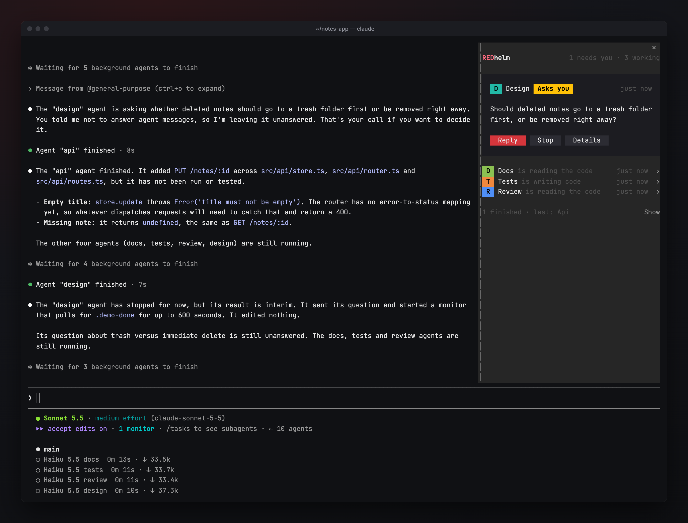
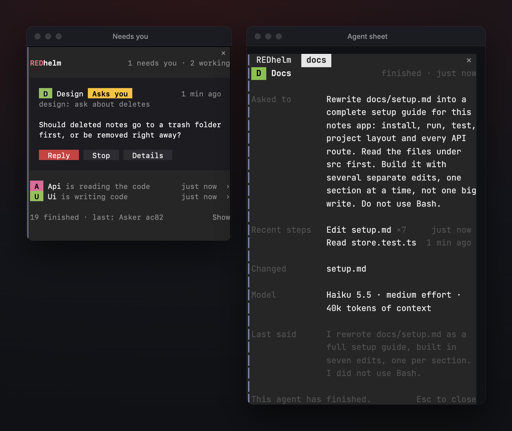
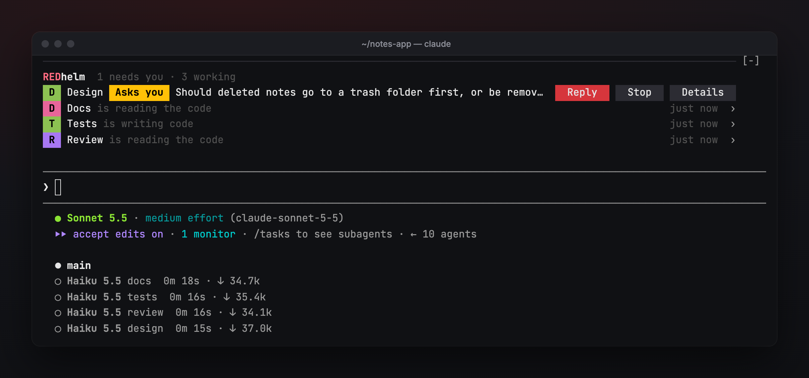

# REDhelm

A live sidebar for your Claude Code agents. See what every agent is doing, where its
work is landing, and which one needs you — and know which model is actually answering.



> **Status: early release (0.4.1).** Covered by tests and checked with real agents:
> the agent list and sheet, **Message** and **Stop**, the model guard, settings and
> workflows. Issues welcome.

## What it does



- **Your agents, in plain words.** One row per agent: what it is doing right now
  (reading the code, writing code, running checks), and for how long. An agent waiting
  on another agent or on work it started says so; only a real question for you is
  marked as needing you.
- **Agent sheet.** Click an agent to see its task, its latest steps, what it is
  thinking, the files it changed, its model and effort, and its last words. Agents that
  started before REDhelm are filled in from Claude Code's record of their conversation.
- **Message and Stop.** Message fills your prompt with `→ name: `; type and press Enter
  to send it to that agent instead of Claude (you can also type `→ name: message`
  yourself). What you were typing to Claude is set aside and comes back after.
- **Needs you.** An agent that sent you a message gets a card with its message and a
  **Reply** button.
- **Where work lands.** A warning when two live agents edit the same file.
- **Workflows.** Picks up lane boards (`docs/aaa/board/lanes.json`), status boards
  (`.status-board/`), REDStudio (`.redstudio/`) and REDManager (`.redmanager/`) in the
  project and shows their progress.
- **Model guard.** If Claude Code switches models on its own, your next prompt and
  Claude's tools wait until you choose with `/model`. If your saved default moved to a
  newer version, the session tells you once.
- **Long-turn notifications.** A desktop notification (macOS, Linux) when a long turn
  finishes.

## Install

Requires Claude Code with function-hook mods (2.1.289 or newer).

```
claude plugin marketplace add watLr/redhelm
claude plugin install redhelm@redhelm
```

Restart running sessions (`/restart`) to load it.

## Use

| Command | |
|---|---|
| `/redhelm` | Open or close the panel |
| `/redhelm right` · `/redhelm bottom` | Sidebar beside the conversation, or a bar above the prompt |
| `/redhelm setup` | Review the Claude Code settings REDhelm recommends |
| `/redhelm models` | Which models actually answered this session, and recent switches |



The right sidebar needs Claude Code's fullscreen layout (`"tui": "fullscreen"`) and a
terminal at least 110 columns wide. That minimum is Claude Code's own and plugins cannot
change it; in a narrower terminal, or the classic layout, REDhelm opens above the prompt
instead.

### Setup card

On first run REDhelm offers a short list of Claude Code settings. Nothing changes until
you press **Apply**:

- Pause instead of switching models when safeguards flag a message
- Show how long each turn took, and timestamp messages
- Push to your phone when a question is waiting (where available)
- A status line with the model that actually answers and its effort, plus model and
  effort on each row of the agent panel (needs `python3`)

### Settings

Every option is a row in `/config`, per user:

| Setting | Values | Default |
|---|---|---|
| Placement | right · bottom | right |
| REDhelm line under the prompt | off · problems · always | off |
| When the model changes without you | hold · warn · off | hold |
| Desktop notification after (seconds) | number, 0 = off | 120 |
| Open REDhelm by itself | on · off | on |
| Pop-ups when agents finish or message you | on · off | on |

## Privacy

REDhelm reads your project folder and Claude Code's own session data on your machine.
It makes no network requests. What it remembers (model switches, the newest model
versions seen, which setup items you handled) stays in Claude Code's plugin storage on
your machine.

## Behaviour notes

- Runs only in interactive sessions; `claude -p`, SDK and other headless runs are left
  untouched.
- If REDhelm itself ever errors, the call it was watching goes through unchanged.

## Develop

```
claude plugin validate plugins/redhelm
claude plugin test plugins/redhelm
```

Load a working copy without installing: `claude --plugin-dir ./plugins/redhelm`.

## License

MIT — see [LICENSE](LICENSE).
